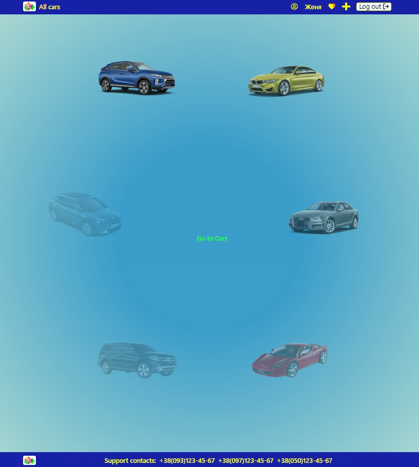
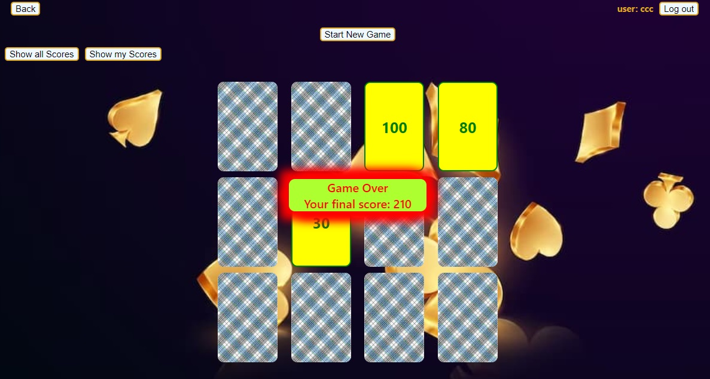
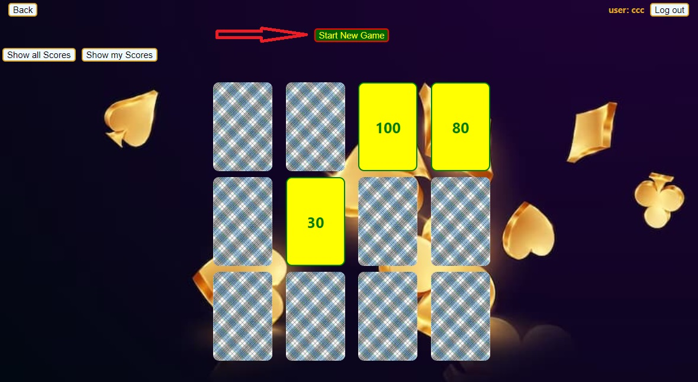
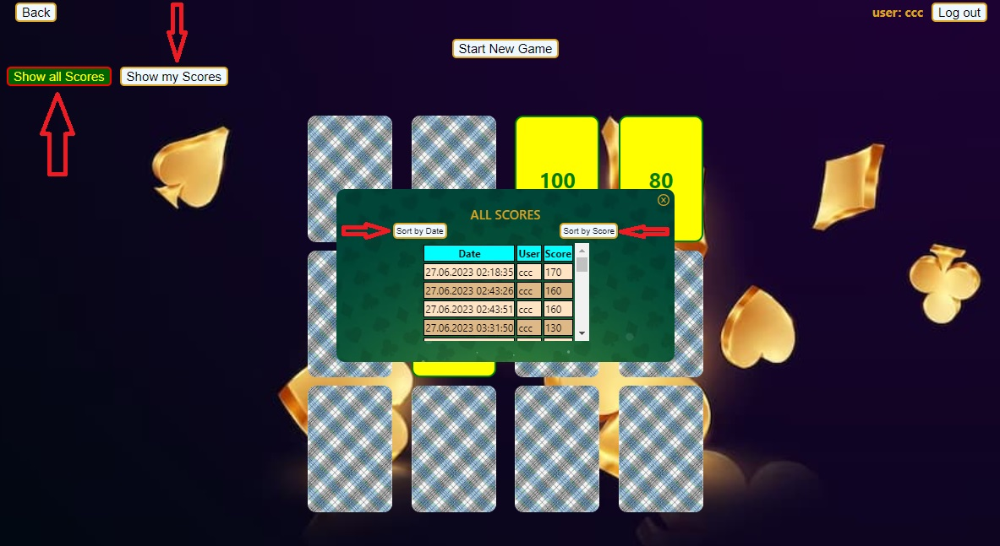
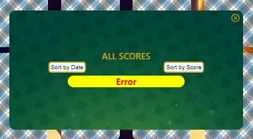

# **_Cards_**

This application is made with  
[Create React App](https://github.com/facebook/create-react-app).

---

## **_Description application_**

App link -
[https://cards-fawn-nine.vercel.app/](https://cards-fawn-nine.vercel.app/)

App is a game, where user can choose cards and score points. After Sign In user
can save his score automatically after each game. He can view score history
every user ant his own history as well. User can sort score history by date and
by user as well.

App consists of two pages: [Home](https://cards-fawn-nine.vercel.app/) and
[Cards](https://cards-fawn-nine.vercel.app/cards).

On the page [Home](https://cards-fawn-nine.vercel.app/) we can see general
decoration of Home page with animation. Also on Home page is button
`«Go to Cards»` that we can click on and go to the page
[Cards](https://cards-fawn-nine.vercel.app/cards).

Page [Cards](https://cards-fawn-nine.vercel.app/cards) looks like this:

On this page user can play the game. User chooses a card and click on it. After
this user's action card turns and user can see score. This score adds to current
user's score. After choosing three cards the game is over and user can see his
final score a few seconds. After few seconds final score disappears and
automatically is being saved saved to the score history (if user Signed In).

After click on button `«Start New Game»`
 user can start new game.

Also on the page `«Cards»` in left high corner exists button `«Back»` that user
can click on and return to the page `«Home»`.

On the page `«Cards»` Signed In user can see general or his own score history.
For this he must click on button `«Show all Scores»` or `«Show my Scores»`
accordingly.

User can also sort score history by date or score by clicking on buttons
`«Sort by Date»` or `«Sort by Score»` accordingly.

User can scroll down the list of scores.

User can face with different errors during using application. On page `«Cards»`
error will be showed at the bottom of the page.

Error of loading of the score history will be showed at the middle of the
history window.

---

## **_Udsed frameworks for creating this application_**

[axios](https://axios-http.com/)
[prop-types](https://github.com/facebook/prop-types)
[Formik](https://formik.org/)
[react-router-dom](https://github.com/remix-run/react-router)
[Moment.js](https://momentjs.com/)
[react-icons](https://github.com/react-icons/react-icons)
[React Redux](https://github.com/reduxjs/react-redux)
[React Persist](https://github.com/rt2zz/redux-persist)
[Yup](https://github.com/jquense/yup)
