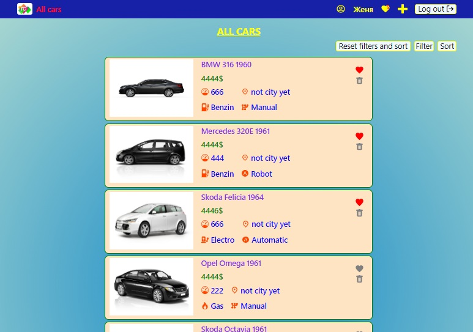
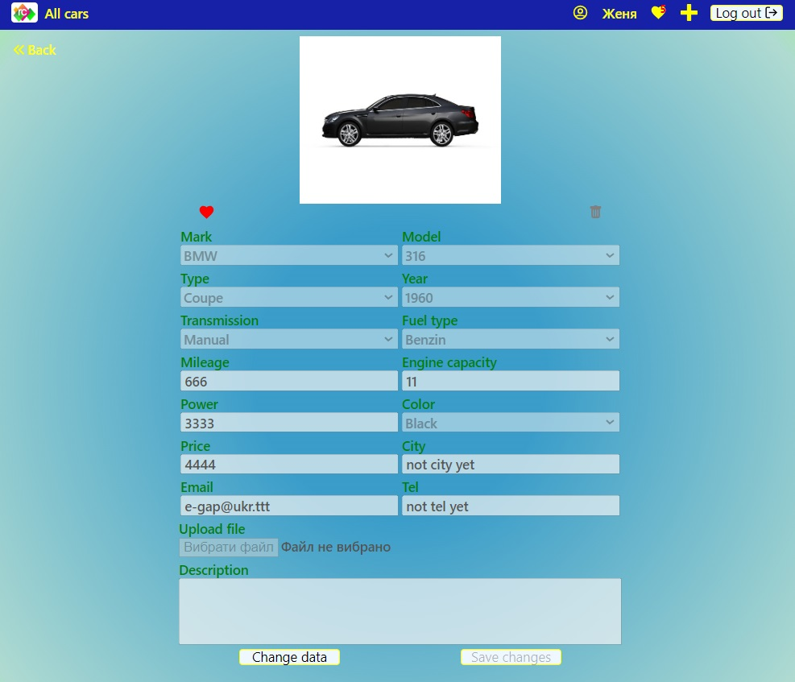
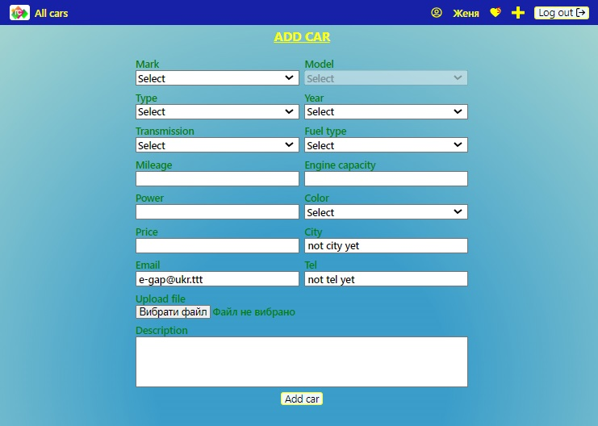
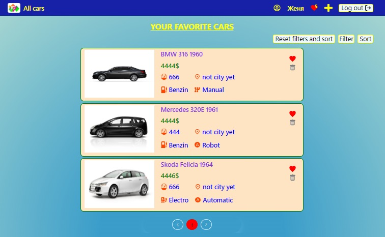
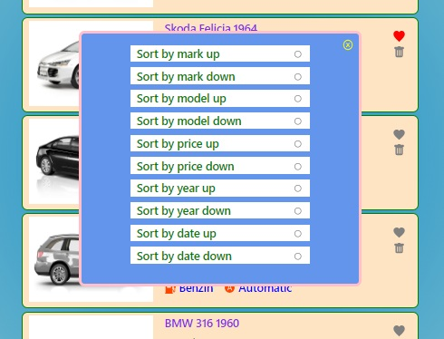
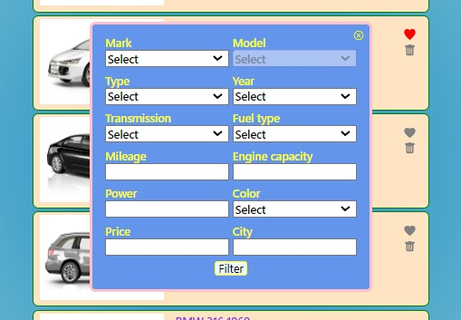
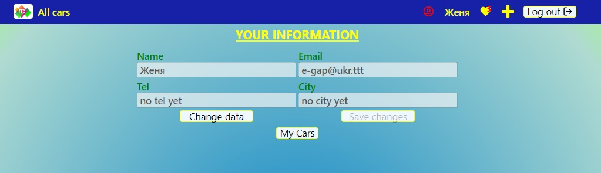

# **_Rent cars_**

This application is made with  
[Create React App](https://github.com/facebook/create-react-app).

---

## **_Description application_**

App link -
[https://cards-fawn-nine.vercel.app/](https://cards-fawn-nine.vercel.app/)

App is a platform, where user can find car for rent or public an ad for rent car
out. After sign in user can also add cars ad to favorite and remove from
favorite. For more comfortable search he can filter and sort all car ads. App
consists of such pages as:  
[Home](https://cards-fawn-nine.vercel.app/),
[All cars](https://cards-fawn-nine.vercel.app/cards),
[User](https://cards-fawn-nine.vercel.app/cards),
[Favorite](https://cards-fawn-nine.vercel.app/cards).  
On the page [Home](https://cards-fawn-nine.vercel.app/) we can see general
decoration of Home page with animation.
 Also on Home page is button
`«Go to Cars»` that we can click on and go to the page
[All cars](https://cards-fawn-nine.vercel.app/cards).  
Page [All cars](https://cards-fawn-nine.vercel.app/cards) looks like this:
  
If user is not loged in he can only review the list of all cars and review page
of certain car:  After loggin
in he can add his own car's ad:   
and create his own list of favorite cars:
  
User can also sort list of cars by pressing on button `«Sort»`:
  
or filter list by pressing on button `«Filter»`:  
  
User can change his own information on
[User page](https://cards-fawn-nine.vercel.app/cards):

---

## **_Udsed frameworks for creating this application_**

[axios](https://axios-http.com/)
[prop-types](https://github.com/facebook/prop-types)
[Formik](https://formik.org/)
[react-router-dom](https://github.com/remix-run/react-router)
[react-icons](https://github.com/react-icons/react-icons)
[React Redux](https://github.com/reduxjs/react-redux)
[React Persist](https://github.com/rt2zz/redux-persist)
[Yup](https://github.com/jquense/yup)
